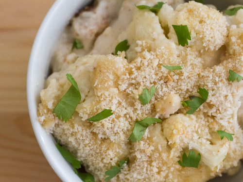

# Crunchy Cauliflower Casserole

Southern breaded cauliflower is cheesy and creamy, with a few added spices to make things interesting. If you like, you can leave out the nutmeg and cumin, but they really do take the dish from standard to sensational.

*cauliflower, vegetarian, main, bechamel, casseroles, gratin, american, southern american*

**4 servings**

---

- *1 head* cauliflower, cut into florets
- *3 tablespoons* unsalted butter
- *1* medium shallot, diced (about 1/4 cup)
- *3 tablespoons* flour
- *1/2 teaspoon* freshly ground white pepper
- *1/2 teaspoon* ground nutmeg
- *1/2 teaspoon* ground cumin
- *2 1/4 cups* whole milk, warm
- *1/4 cup* heavy cream
- *3/4 cup* grated pecorino Roman cheese, divided
- *1 1/2 teaspoons* kosher salt
- *1/2 cup* panko-style bread crumbs
- *2 tablespoons* melted butter
- *2 tablespoons* roughly chopped fresh parsley leaves

---

Set the oven rack to the middle and preheat to 200°C. Pour 1/2 cup of water into the bottom of a pot fitted with a vegetable steamer. Cover and set over medium heat. Once the water boils, drop florets into the steamer, cover, and steam until tender but not mushy, about 10 minutes. Remove from heat.

Grease the bottom and sides of a small casserole dish and arrange the florets in a layer inside.

Add butter to a small heavy saucepan and melt over low heat. Add shallot and cook until gently browned, stirring occasionally, about 3 minutes. Whisk in flour, pepper, nutmeg, and cumin. Continue to cook, stirring constantly, until pale golden brown, about 3 minutes. Slowly whisk in milk and heavy cream and cook, stirring constantly, until the sauce comes to a boil and coats the back of a spoon. Remove from heat and stir in 1/2 cup of the pecorino. Season to taste with salt, then pour sauce over cauliflower in casserole dish.

In a small bowl combine bread crumbs, melted butter, and remaining pecorino. Stir well and sprinkle over the top of the florets. Bake until gently browned, about 20 minutes. Sprinkle with parsley and serve immediately, or alternatively, sprinkle with more cheese and broil briefly for a darker, crisper topping.

Source: [seriouseats.com](https://www.seriouseats.com/recipes/2013/07/comfort-me-with-crunchy-cauliflower-casserole-recipe.html)