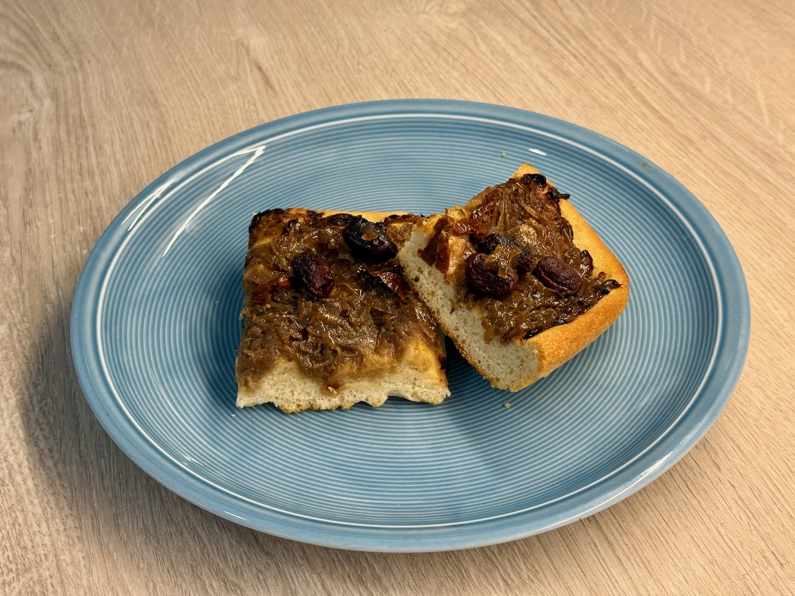

# Focaccia Pissaladière

Pissaladière ist ein Südfranzösischer Zwiebelkuchen, den ich hier mit einem
Focaccia-Teig kombiniert habe.

**4 Portionen, 1 Blech**

---

- *1200g* [Focacciateig](https://raw.githubusercontent.com/dasnessie/recipes/refs/heads/master/focacciateig.md)
- Olivenöl für das Backblech

## Belag

- *100 ml* Sojasoße
- *1 TL* Zucker
- *1,2* kg Zwiebeln
- *3 EL* Olivenöl
- *3 TL* getrocknete Kräuter der Provence
- *1 EL* Weißweinessig
- *75 g* getrocknete Tomaten in Öl 
- *100 g* Kalamata-Oliven ohne Stein

---

## Teig

- Focaccia-Teig nach Rezept zubereiten und gehen lassen

- Das Backblech mit Olivenöl einreiben. Den Teig in die Form stürzen und mit den
  Fingern vorsichtig in die Ecken ziehen. Mit einem feuchten Handtuch abdecken
  und eine weitere halbe Stunde gehen lassen.

## Belag

- Zwiebeln schälen, halbieren und in 1-2 mm dicke Ringe oder Halbringe
  schneiden.

- Sojasoße mit Zucker in kleinen Topf geben, aufkochen und im offenen Topf 5-6
  Minuten bei niedriger bis mittlerer Hitze zu einer dickflüssigen Paste
  einkochen lassen. Vom Herd nehmen und etwas abkühlen lassen. 

- Öl in großer Pfanne erhitzen und Zwiebeln unter gelegentlichem Rühren 10
  Minuten bei mittlerer Hitze anschwitzen, bis sie glasig sind, aber noch keine
  Farbe angenommen haben. 1 TL Salz sowie Kräuter der Provence unterrühren und
  Zwiebeln in geschlossener Pfanne 15 Minuten bei niedriger Hitze dünsten,
  sodass sie hell bleiben. 3 TL der Sojapaste mit Essig unterrühren.
  Zwiebelmischung mit Salz würzig abschmecken und vom Herd nehmen.

- Tomaten leicht abtropfen lassen und längs in 0,5 cm breite Streifen schneiden.

## Backen

- In den Teig mit den Fingern kleine Dellen drücken.

- Zwiebelmischung auf den Teig geben. Tomaten und Oliven darauflegen 

- Im vorgeheizten Ofen bei 230 °C Ober-/Unterhitze 25-30 Minuten backen. Ggf.
  nach 5 Minuten Backzeit mit Backmatte abdecken, damit die Tomaten nicht dunkel
  werden.