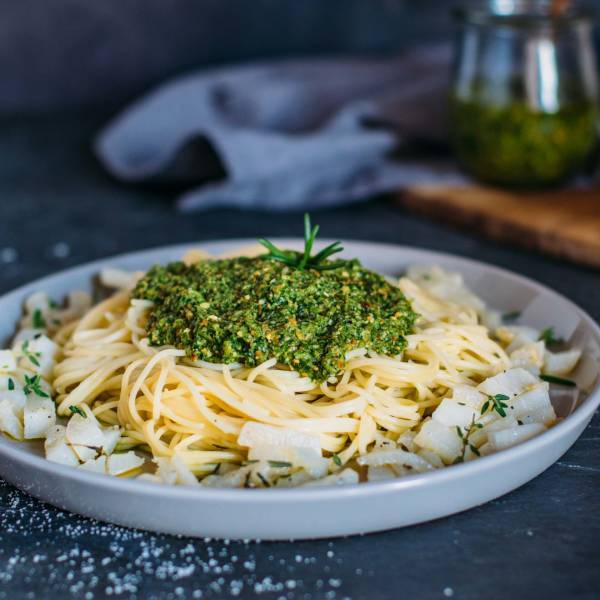

# Pasta mit Mairübchen-Pesto

Zero Waste: schone nicht nur die Umwelt, sondern auch deinen Geldbeutel\! Besonders das schöne Grün der Mairübchen wandert oft einfach in den Müll – schade eigentlich\! Das dachten wir uns auch und haben deshalb ein herrlich leckeres Pesto daraus gezaubert. Zusammen mit den angebratenen Mairübchen ein absolutes Highlight ohne Reste\!

*Kochen, Nudeln, Pasta, Spaghetti, Mairübchen, Olivenöl*

**4 Portionen**

---

- *500 g* Spaghetti
- *500 g* Mairübchen, mit Grün
- *3 EL* Olivenöl
- *2 Zweige* Thymian
- *0.5 TL* Salz
- *1 Prise* Pfeffer
- *1 TL* Rohrzucker
- *40 g* Pinienkerne
- *100 ml* Olivenöl
- *0.5 TL* Salz
- *1 Prise* Pfeffer
- *1 Zweig* Rosmarin
- *1 Zweig* Thymian

---

Das Grün der Mairübchen am unteren Stiel abtrennen, gründlich waschen und grob hacken. Die Mairübchen schälen und in grobe Stifte schneiden.

Wasser für die Spaghetti aufsetzen. Für das Pesto die Pinienkerne leicht rösten, bis sie etwas braun werden. Kräuter für das Pesto abbrausen, trockenschütteln und abzupfen. Anschließend das Mairübchengrün mit den Pinienkernen, Salz, Pfeffer, Thymian, Rosmarin und Olivenöl in den Blitzhacker geben und zu einem Pesto mixen.

Die Spaghetti wie auf der Packung angegeben zubereiten. Währenddessen den Thymian für die Mairübchen ebenfalls abbrausen, trockenschütteln und abzupfen. Die Mairübchen mit Olivenöl, Salz, Pfeffer und dem frischem Thymian in der Pfanne anbraten. Nach 5 Minuten mit Rohrzucker karamellisieren.

Die gekochten Spaghetti mit dem Pesto und den Mairüben servieren.

https://www.sevencooks.com/de/rezept/pasta-mit-mairuebchen-pesto-15734