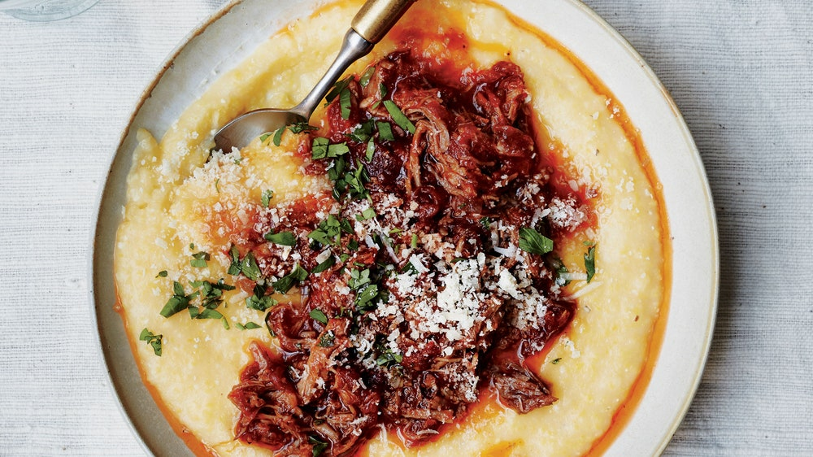

# Pork Ragù over Creamy Polenta

Leftover sauce? Bring a pot of water to boil: It’s pasta night.

**8 servings**

---

## Ragù

- *1.5 kg* skinless, boneless pork shoulder (Boston butt), cut into 1 pound pieces
- Kosher salt and freshly ground black pepper
- *15 ml* vegetable oil
- *100 g* onion, finely chopped
- *6* garlic cloves, finely chopped
- *30 g* tablespoons tomato paste
- *150 ml* full-bodied red wine
- *800 g* canned whole peeled tomatoes
- *4 sprigs* thyme
- *2 sprigs* rosemary
- *2* bay leaves

## Polenta and Assembly

- Kosher salt
- *400 g* coarse polenta (not quick-cooking)
- *60 g* unsalted butter
- *80 g* grated Parmesan (from about 2 ounces), plus more for serving
- Freshly ground black pepper
- *25 g* chopped fresh parsley
- *15 ml* Olive oil (for drizzling)

---

Pork: Season pork with salt and pepper. Heat oil in a large heavy pot over medium. Cook pork, turning often, until evenly browned, 10–12 minutes. Transfer to a platter and pour off pan drippings.

Wipe out any burned bits from pot, but leave the golden-brown pieces (doing this will keep the finished sauce from tasting bitter). Add onion and garlic to pot and cook, stirring occasionally, until onion is starting to brown and caramelize, 12–15 minutes. Add tomato paste and cook, stirring occasionally, until slightly darkened in color, 5–8 minutes.

Add wine and cook, scraping up any browned bits, until reduced by about half, 5–8 minutes.

Add tomatoes, crushing with your hands as you go, then add thyme, rosemary, and bay leaves; stir in 2 cups water. Add pork with any juices accumulated on the platter; season with salt and pepper.

Bring liquid to a boil, then reduce heat and simmer, partially covered, until pork is falling-apart tender, sauce is thickened (it will be thicker than a typical pasta sauce), and flavors have melded, 2½–3 hours.

Using 2 forks, break up pork into pieces or shred it (your choice!); taste and season with salt and pepper.

Pork can be cooked 5 days ahead. Let cool; cover and chill in sauce.

Polenta and assembly: Bring water (4 times of polenta by volume) salted water to a boil in a large pot. Whisking constantly, gradually add polenta; reduce heat to medium-low. Cook, whisking often, until polenta is tender and creamy, 20–25 minutes (if polenta becomes too thick too soon, loosen mixture by adding more water and continue cooking). Add butter and Parmesan to polenta and whisk until melted; season with salt and pepper.

Spoon polenta into bowls or onto a platter and top with pork. Scatter parsley and more Parmesan over top and drizzle with oil.

https://www.bonappetit.com/recipe/pork-ragu-creamy-polenta