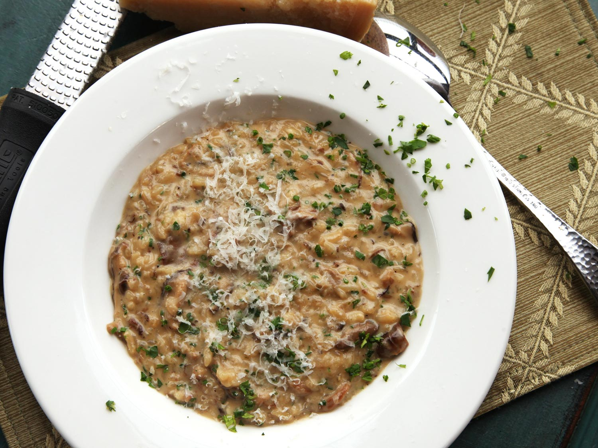

# Pressure Cooker Mushroom Risotto

The pressure cooker is the fastest and most reliable way to cook perfect risotto. This version comes out creamy and intensely flavored with fresh mushrooms and dried porcini. A touch of miso paste gives it savory depth.

*pressure cooker, main, fall, winter, easy, mushroom, quick, rice, risotto, vegetarian*

**5 servings**

---

- *950ml* homemade or store-bought low-sodium chicken stock or vegetable stock
- *30g* dried porcini mushrooms (optional)
- *700g* mixed mushrooms, such as shiitake, cremini, oyster, and chanterelle, trimmed and thinly sliced, stems reserved
- *60ml* extra-virgin olive oil
- *50g* unsalted butter
- Kosher salt and freshly ground black pepper
- *170g* yellow onion, finely chopped
- *2* medium cloves garlic, finely minced
- *300g* risotto rice, such as arborio or vialone nano
- *10ml* soy sauce
- *15ml* light miso paste
- *175ml* dry white wine
- *60ml* heavy cream (optional, see note)
- *30g* finely grated Parmigiano-Reggiano cheese, plus more for serving
- Handful finely minced mixed fresh herbs, such as parsley, chervil, tarragon, and/or chives

---

Place chicken stock and dried mushrooms (if using) in a microwave-safe container and microwave on high power until simmering, about 5 minutes. Remove from microwave. Using a slotted spoon, transfer porcini to a cutting board and roughly chop. Add fresh mushroom scraps to container with porcini-infused stock and set aside.

Heat olive oil and butter in the base of a pressure cooker over high heat, swirling, until foaming subsides. Add fresh mushrooms, season with salt and pepper, and cook, stirring occasionally, until excess moisture has evaporated and mushrooms are well browned, about 8 minutes.

Add onion, garlic, and chopped porcini (if using) and cook, stirring frequently, until onions are softened and aromatic, about 4 minutes. Add rice and cook, stirring, until rice is evenly coated in oil and toasted but not browned, 3 to 4 minutes. (Rice grains should start to look like tiny ice cubes: translucent around the edges and cloudy in the center.) Stir in soy sauce and miso paste until evenly incorporated.

Add wine and cook, stirring, until raw alcohol smell has cooked off and wine has almost fully evaporated, about 2 minutes.

Pour stock into pot through a fine-mesh strainer, discarding mushroom stems. Scrape any grains of rice or pieces of onion from side of pressure cooker so that they are fully submerged. Close pressure cooker and bring up to low pressure (10 psi on most units). Cook at low pressure for 5 minutes, then depressurize cooker, either by running it under cold water if it is not electric or using the steam-release valve if it is electric.

Open pressure cooker and stir to combine rice and cooking liquid; a creamy consistency should begin to develop. Stir in cream (if using), cheese, and herbs. If risotto is too soupy, cook for a few minutes longer, stirring, until it begins to thicken more. If it is too thick, stir in some hot water. It should flow slowly when you drag a trail through it with a spoon. Season to taste with salt and pepper and serve immediately on hot plates, passing extra cheese at the table.

https://www.seriouseats.com/recipes/2014/12/pressure-cooker-mushroom-risotto-recipe.html