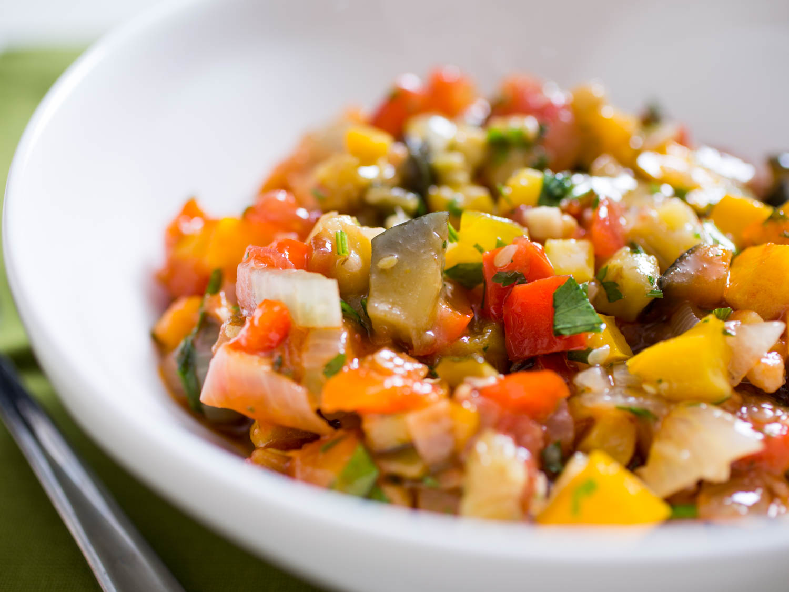

# Provençal Ratatouille

This classic Provençal summer stew features eggplant, summer squash, bell peppers, onion, garlic, and tomatoes, along with plenty of olive oil. If you can resist eating it all while it's still hot, it gets even better the next day, served slightly chilled or at room temperature.

*vegetarian, side, main, french, summer, vegan*

**2 l, 5 servings**

---

- *2* medium summer squash, such as zucchini and yellow squash
- *1* medium Italian eggplant
- *200 ml* extra-virgin olive oil, divided, plus more as needed
- *3* medium yellow onions
- *6* medium cloves garlic, minced
- *4* large red and yellow bell peppers
- *800 g* canned whole tomatoes, with their juices, pureed
- *1* bouquet garni (herb bundle), made from fresh herbs such as thyme, parsley, and basil, tied together with butcher's twine
- *30 g* fresh parsley
- *15 ml* balsamico
- *10 g* sugar
- Kosher salt
- Freshly ground black pepper

---

Dice summer squash, eggplant, onion, and bell peppers into ½ to 1 cm dice.

Place summer squash in a wire mesh strainer set over a bowl; place eggplant in a second wire mesh strainer and set over a second bowl. Toss both with a liberal amount of kosher salt and let stand to drain at least 15 minutes and up to 1 hour. Discard any liquid that collects in the bowls.

In a large skillet, heat ¼ of the olive oil over medium-high heat until shimmering. Add onion and garlic, season with salt, and cook, stirring, until softened, about 6 minutes. Scrape onion and garlic onto a rimmed baking sheet and spread in an even layer to cool for 3 minutes. Transfer onion and garlic to a large pot.

Meanwhile, add another ¼ of the olive oil to skillet and heat over medium-high heat until shimmering. Add bell pepper, season with salt, and cook, stirring, until softened, about 7 minutes. Scrape bell pepper onto the rimmed baking sheet in an even layer to cool for 3 minutes. Transfer bell pepper to pot with onion.

Add another ¼ of the olive oil to skillet and heat over medium-high heat until shimmering. Add summer squash and cook, stirring, until softened, about 4 minutes. Scrape onto rimmed baking sheet in an even layer to cool for 3 minutes. Transfer to pot with onion and bell pepper.

Add remaining ¼ of the olive oil to skillet and heat over medium-high heat until shimmering. Add eggplant and cook, stirring, until softened, about 4 minutes; add more olive oil as needed if skillet dries out while cooking eggplant. Scrape eggplant into pot with other vegetables and stir to combine.

Set pot of vegetables over medium-high heat and stir in tomato puree and herb bundle; heat until ratatouille is gently bubbling, then lower heat to medium and cook, stirring, until tomato puree coats vegetables in a thick sauce, about 15 minutes. Discard herb bundle. Season with salt, pepper, sugar, and balsamico. Stir in chopped parsley (if using), and drizzle with a small amount of fresh extra-virgin olive oil. Serve right away, or chill and serve either reheated, slightly chilled, or at room temperature.

Source: [seriouseats.com](https://www.seriouseats.com/recipes/2015/08/ratatouille-provence-vegetable-stew-recipe.html)