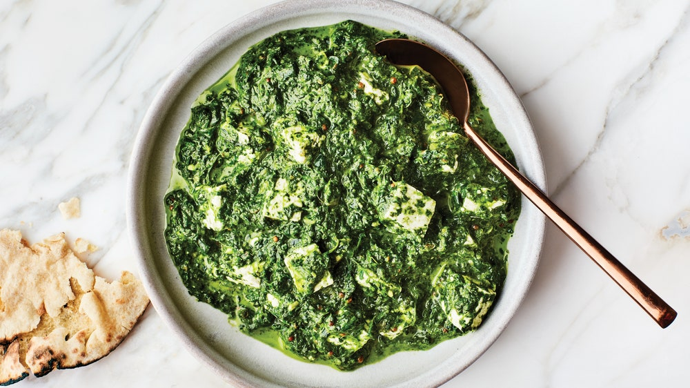

# Saag Paneer, but with Feta

Umami-charged asafetida is well worth seeking out at an Indian grocer or online—just a pinch of this pungent powder makes all the other spices come alive. Feta and spinach is an iconic combination, but mozzarella or even tofu cubes are also great here.

**4 servings**

---

- *80 ml* ghee or extra-virgin olive oil
- *2 Tbsp* coriander seeds
- *¼ tsp* ground cardamom
- *1* small onion, chopped
- *1* garlic clove, finely chopped
- *1 1½" piece* ginger, peeled, chopped
- *450 g* baby spinach
- *1* small Indian green chile or serrano chile, coarsely chopped
- *20 ml* fresh lime juice
- Kosher salt
- *200 g* feta, cut into 1" pieces
- *1 tsp* cumin seeds
- *¼ tsp* asafetida (optional)
- *¼ tsp* red chili powder
- *4 Portionen* [Reisbeilage](reisbeilage.md)

---

Heat ¼ cup ghee in a large skillet over medium. Cook coriander seeds and cardamom, stirring constantly, until starting to brown, about 2 minutes. Add onion and cook, stirring occasionally, until translucent and slightly browned, about 5 minutes. Mix in garlic and ginger and cook, stirring, 1 minute. Add spinach by the handful, letting it wilt slightly after each addition before adding more. Cook until all of the spinach is just wilted, about 3 minutes. Remove pan from heat and add chile and lime juice; season with salt. Let cool 5 minutes.

Transfer spinach mixture to a blender (reserve skillet) and blend until a coarse paste forms, about 1 minute. Return spinach mixture to pan and set over low heat. Stir in ½ cup water, then gently fold in feta, being careful not to break up. Cook until feta is slightly softened and has absorbed some of the sauce, 5–7 minutes.

Meanwhile, heat remaining 2 Tbsp. ghee in a small saucepan over medium-high, 1 minute. Add cumin seeds. As soon as cumin seeds start to pop, sputter, and brown, remove from heat, 1 minute tops. Immediately add asafetida, if using, and chili powder. Pour ghee mixture over spinach mixture. Serve with roti or rice.

Do Ahead: Spinach mixture (without spiced ghee mixture) can be made 1 day ahead. Let cool; cover and chill.

https://www.bonappetit.com/recipe/saag-paneer-but-with-feta