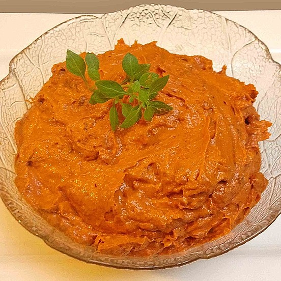

# Würzige Tomatenbutter

Würzige Tomatenbutter - Mit Knoblauch und getrockneten Tomaten. 

*Party, Party, Schnell, einfach, Aufstrich*

**25 Brötchenhälften, 450 g**

---

- *250 g* vegane Butter (Alsan)
- *100 g* Tomatenmark, 3-fach konzentriert
- *2 Zeh* Knoblauch
- *100 g* Tomate(n), getrocknete, in Öl eingelegte

---

Die Butter in einer Schüssel auf Zimmertemperatur bringen. Die getrockneten Tomaten abtropfen und mit einem Pürierstab zerkleinern. Den Knoblauch schälen und durch die Knoblauchpresse zur Butter drücken. Alle Zutaten gut miteinander verrühren und die Tomatenbutter im Kühlschrank aufbewahren.

Am besten 10 Minuten vor dem Servieren herausnehmen.

Schmeckt lecker auf knusprigem Baguette, Brot oder zu Grillfleisch.

Tipp: Basilikum mit unter die Butter rühren.

https://www.chefkoch.de/rezepte/1162851222416611/Wuerzige-Tomatenbutter.html